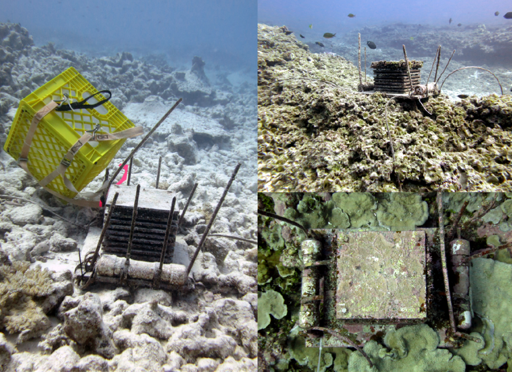

### Keywords {-}
<div custom-style="mono">ARMs, mesophotic coral ecosystems, community structure, dispersal, Hawai&#x02BB;i, brachyuran crabs</div>

\newpage

```{r setup, include=FALSE}
knitr::opts_chunk$set(
  echo = FALSE,
  fig.path="output/figures/fig-",
  dev="svg",
  dpi=300,
  message=FALSE,
  warning=FALSE,
  cache=TRUE,
  cache.path = "cache/",
  cache.comments=FALSE
)

library(tidyverse)
library(pander)
library(fs)
library(here)
library(english)
library(phyloseq) 
library(vegan)
library(ggrepel)
library(here)
library(worrms)
library(BiodiversityR)
```

```{r init, include=FALSE}
source("crabs.R")
if (!exists("crabs_done")) {
  crabs_done <<- FALSE
}
if (!crabs_done) {
  cc <<- setup_crabs()
  crabs_done <<- TRUE
}

format_range <- function(vals) {
  f <- range(vals)
  str_glue("{f[1]}--{f[2]}")
}

plotz_theme <- function() {
  theme_bw() + 
    theme(
      legend.key = element_blank(),
      panel.grid = element_blank()
    )
}

format_species <- function(...) UseMethod("format_species")

format_species.list <- function(spp,authority=TRUE,...) {
  if (spp$found) {
    a <- ifelse(authority,str_glue(" {spp$authority}"),"")
    str_glue("*{spp$species}*{a}")
  } else {
    s <- str_split(spp$species," ")[[1]]
    str_trim(str_glue("*{s[1]}* {s[2]}"))
  }
}

format_species.character <- function(species,found,authority,auth=TRUE,...) {
  spp <- map2_chr(species,found,~{
    .y <- ifelse(is.na(.y),FALSE,.y)
    s <- list(species=.x,found=.y,authority="")
    format_species(s,FALSE)
  })
  if (auth) {
    authority <- if_else(!is.na(authority),str_c(" ",authority),"")
    spp <- str_c(spp,authority)
  }
  return(spp)
}

format_species.data.frame <- function(spp,authority=TRUE,...) {
  spp %>%
    pwalk(~{
      row <- list(...)
      s <- row[c('species','found','authority','otu')]
      print(format_species(s,authority))
    })
}

pc <- function(x,a=0.01) scales::percent_format(accuracy = a)(x)
num <- function(x,a=0.01) scales::label_comma(accuracy=a)(x)

t_test <- function(test,plain=FALSE) {
  if (plain) {
    str_glue("*t* = {num(test$statistic,0.01)}, DF = {num(test$parameter['df'],0.01)}, {pval(test$p.value)}")
  } else {
    str_glue("(two-sample t-test: *t* = {num(test$statistic,0.01)}, DF = {num(test$parameter['df'],0.01)}, {pval(test$p.value)})")
  }
}

pval <- function(p) {
  case_when(
    p < 0.001 ~ "*p* \\< 0.001",
    p < 0.01 ~ "*p* \\< 0.01",
    TRUE ~ as.character(str_glue("*p* = {num(p,0.01)}"))
  )
}

permdisp <- function(bd,accuracy=0.01,perm=999) {
  a <- anova(bd,permutations=perm) %>%
    broom::tidy() %>%
    filter(term == "Groups")
  with(a,str_glue("DF = {num(df,accuracy)}, SS = {num(sumsq,accuracy)}, F = {num(statistic,accuracy)}, {pval(p.value)}"))
}

permanova <- function(modl,accuracy=0.01,stat="pseudo-F",by=NULL,sentence=TRUE) {
  has_r2 <- TRUE
  if (is(modl,"dbrda")) {
    modl <- anova(modl,by=by)
    has_r2 <- FALSE
  }
  m <- suppressWarnings(broom::tidy(modl)) %>%
    filter(!term %in% c("Total","Residual"))
  if (nrow(m) > 1) {
    m %>%
      pmap_chr(~{
        with(list(...), {
          if (has_r2) {
            r2 <- str_glue(" $\\mathrm{{R}}^2$ = {num(R2,0.01)},") 
          } else {
            r2 <- ""
          }
          if (sentence) {
            term <- str_replace_all(term,"_"," ")
          }
          str_glue("{term}: DF = {num(df,accuracy)}, SS = {num(SumOfSqs,accuracy)},{r2} {stat} = {num(statistic,accuracy)}, {pval(p.value)}")
        })
      }) %>%
      str_c(collapse = "; ")
  } else {
    with(m %>% slice(1),{
      if (has_r2) {
        r2 <- str_glue(" $\\mathrm{{R}}^2$ = {num(R2,accuracy)},") 
      } else {
        r2 <- ""
      }
      if (sentence) {
        term <- str_replace_all(term,"_"," ")
      }
      str_glue("{term}: DF = {num(df,accuracy)}, SS = {num(SumOfSqs,accuracy)},{r2} {stat} = {num(statistic,accuracy)}, {pval(p.value)}")
      # str_glue("DF = {num(df,accuracy)}, SS = {num(SumOfSqs,accuracy)}, $\\mathrm{{R}}^2$ = {num(R2,accuracy)}, pseudo-F = {num(statistic,accuracy)}, {pval(p.value)}")
    }) 
  }
}

top_list <- function(species,n,units,len=4,fig=NULL) {
  s1 <- map_chr(species,format_species)
  s2 <- map2_chr(n,units,~{
    if (is.null(fig)) {
      str_glue("(with {.x} individuals on {.y} units)")
    } else {
      str_glue("(with {.x} individuals on {.y} units; [@fig:{fig}[]{{{{}}}}{{.y}}])")
    }
  })
  if (!is.null(fig)) {
    s2 <- map2_chr(s2,LETTERS[seq(length(s2))],~str_glue(.x))
  }
  ss <- str_c(s1," ",s2)
  ss[1:(len-1)] %>%
    str_c(collapse=", ") %>%
    str_c(", and ",ss[len])
}

print_table <- function(tbl,id="",caption="",hdr_case="sentence",hide=character(0),accuracy = 0.01) {
  if (!grepl("^: ",caption)) {
    caption <- paste0(": ",caption)
  }
  
  if (inherits(tbl,"character")) {
    if (id == "") {
      id <- sub(pattern = "(.*?)\\..*$", replacement = "\\1", basename(file))
    }
    tbl <- read.csv(tbl,check.names=FALSE,stringsAsFactors=FALSE)
  } else if (inherits(tbl,"data.frame")) {
    if (id == "") stop("please specify table id")
  } else {
    stop("'tbl' must be a character or a data frame")
  }
  
  tbl <- tbl %>%
    select(-any_of(hide)) %>%
    mutate(
      across(
        where(is.numeric),
        ~num(.x,accuracy)
      )
    )
  
  
  # can also use rename_with(str_to_sentence)
  names(tbl) <- switch(
    str_to_lower(hdr_case),
    sentence = str_to_sentence(names(tbl)),
    title = str_to_title(names(tbl)),
    names(tbl)
  )
  
  caption <- sprintf("%s {#tbl:%s}",caption,id)
  
  table_str <- capture.output(pander::pandoc.table(tbl,keep.line.breaks=TRUE,caption=NULL,style="grid",split.cells=Inf,split.tables=Inf,justify='left',missing=''))
  table_str <- table_str[table_str != ""]
  cat(paste0(table_str,collapse="\n"),"\n\n",caption,"\n\n",sep="")
}

cc$crabs_deep <- cc$crabs_untransformed %>% subset_samples(shallow_deep == "deep")
cc$crabs_deep <- prune_taxa(taxa_sums(cc$crabs_deep) > 0,cc$crabs_deep)
cc$crabs_shallow <- cc$crabs_untransformed %>% subset_samples(shallow_deep == "shallow")
cc$crabs_shallow <- prune_taxa(taxa_sums(cc$crabs_shallow) > 0,cc$crabs_shallow)

dir_create(here("cache"))
if (file_exists(here("cache","all_summary.rds"))) {
  all_summary <<- read_rds(here("cache","all_summary.rds"))
} else {
  all_summary <<- sample_summary(cc$crabs_untransformed,4)
  write_rds(all_summary,here("cache","all_summary.rds"))
}
if (file_exists(here("cache","deep_summary.rds"))) {
  deep_summary <<- read_rds(here("cache","deep_summary.rds"))
} else {
  deep_summary <<- sample_summary(cc$crabs_deep,4)
  write_rds(deep_summary,here("cache","deep_summary.rds"))
}

all_alpha <- alpha_diversity(cc$crabs_untransformed)
deep_alpha <- alpha_diversity(cc$crabs_deep)
shallow_alpha <- alpha_diversity(cc$crabs_shallow)

# palette for island/group colors
island_pal <- c(
  "Hawaii Island" = "#8a3ffc",
  "Hawai‘i Island" = "#8a3ffc",
  "Maui" = "#007d79",
  "Oahu" = "#ff7eb6",
  "O‘ahu" = "#ff7eb6",
  "Kauai" = "#fa4d56",
  "Kaua‘i" = "#fa4d56",

  "French Frigate Shoals" = "#fff1f1",
  "Lalo" = "#fff1f1",
  "Lisianski" = "#6fdc8c",
  "Kapou" = "#6fdc8c",
  "Pearl and Hermes Reef" = "#4589ff",
  "Manawai" = "#4589ff",
  "Kure Atoll" = "#d12771",
  "Hōlanikū" = "#d12771"
)
island_group_pal <- c(
  "main" = "#ffb400",
  "Main" = "#ffb400",
  "Northwest" = "#9080ff",
  "northwest" = "#9080ff"
)

# colors for sample group / depth zone
sample_depth_pal <- c(
  "shallow" = "#ffb400",
  "Shallow" = "#ffb400",
  "Shallow (MHI)" = "#ffb400",
  "shallow_main" = "#ffb400",
  "Shallow (NWHI)" = "#9080ff",
  "shallow_nwhi" = "#9080ff",
  "30 m" = "#d87939",
  "30m" = "#d87939",
  "60 m" = "#04c3c8",
  "60m" = "#04c3c8",
  "90 m" = "#04738d",
  "90m" = "#04738d",
  "deep" = "#04738d",
  "Deep" = "#04738d"
)

PERM <<- 999

```

# 1. Introduction {-}

# 2. Materials and Methods {-}

## Sample Collection {-}

Brachyuran crab assemblages were sampled from benthic coral reef habitat in the Hawaiian Archipelago using Autonomous Reef Monitoring Structures (ARMS). ARMS are standardized collection devices designed to mimic coral reef structural complexity to attract settlement of reef cryptofauna [@brainardAutonomousReefMonitoring2009; @zimmermanArtificialReefMatrix2004]. They are constructed from 10 gray type 1 PVC plates (23 cm $\times$ 23 cm) stacked in an alternating series of open and semi-enclosed layers ([@fig:fig_arms]). The stack is fastened to a larger base plate (35 cm $\times$ 45 cm) which can be attached to the benthos upon deployment [@brainardAutonomousReefMonitoring2009; @hurleyAssessmentShallowMesophotic2016; @knowltonCoralReefBiodiversity2010; @zimmermanArtificialReefMatrix2004]. 

{#fig:fig_arms}

A total of 89 ARMS units were deployed over the course of six years (2010--2016). Units were deployed by NOAA scuba divers during Pacific Reef Assessment and Monitoring Program (RAMP) research cruises in shallow coral reef habitat (12–16 m depth) in both the Main (MHI) and Northwest Hawaiian Islands (NWHI) ([@tbl:arms_table]). The sites in the MHI were at Hawai&#x02BB;i Island, Maui, O&#x02BB;ahu, and Kaua&#x02BB;i. The sites in the NWHI were at Lalo (French Frigate Shoals), Kapou (Lisianski), Manawai (Pearl & Hermes), and Hōlanikū (Kure Atoll) ([@fig:fig_map]). To explore the effects of depth on crab community structure, we also present data from a previous study by Hurley et al. [-@hurleyAssessmentShallowMesophotic2016], which included a total of 27 units deployed off O&#x02BB;ahu from 2009–2012 in 12–90 m depth; nine units were deployed at 12 m, and six each at 30 m, 60 m, and 90 m ([@tbl:arms_table]). Shallow units were deployed according to standard NOAA methodology, whereas units $\geq$ 30 m were deployed and recovered using technical mixed-gas closed-circuit rebreather diving [see @hurleyAssessmentShallowMesophotic2016]. 

```{r arms-table,results="asis", dependson="init"}
arms_schedule <- cc$crabs_untransformed %>%
  sample_tibble() %>%
  separate_wider_regex(sample,patterns=c(recovery_year="^[0-9]+","_",sample=".*"))  %>%
  select(sample,everything()) %>%
  unite("range",deployment_year,recovery_year,sep="--") %>%
  mutate(
    island = case_when(
      str_remove_all(hawaiian_name,'[^a-zA-Z ]') != island ~ as.character(str_glue("{hawaiian_name} ({island})")),
      TRUE ~ as.character(hawaiian_name)
    ),
    island = case_when(
      island == "O‘ahu" ~ str_glue("{hawaiian_name} ({shallow_deep})"),
      TRUE ~ island
    ),
    island = fct_reorder(island,-lat)
  ) %>%
  count(island,range) %>%
  pivot_wider(names_from="range",values_from="n")  %>%
  select(island,order(colnames(.))) %>%
  mutate(across(-island,~replace_na(.x,0)))
print_table(arms_schedule,"arms_table","ARMS unit deployment schedule (number of units)",accuracy=1) 
```

```{r site-map, fig.cap='Sampling map (Papahānaumokuākea Marine National Monument shaded in light blue)', results="asis", fig.width=9, fig.height=6, dependson="init"}
library(sf)
library(rnaturalearth)

crab_sites <- cc$crabs_untransformed %>%
  sample_tibble() %>%
  distinct(hawaiian_name,island_group,lat,lon,.keep_all = FALSE) %>%
  # mutate( island = fct_reorder(island,-lat) ) %>%
  st_as_sf(coords=c("lon","lat"),crs=4326, remove=F) #%>%

hawaii <- ne_states("united states of america",returnclass = "sf") %>%
  filter(name == "Hawaii")

trans_box <- function(b,crs) {
  box_before <- st_sfc(
    st_point(b[c(1,2)]),
    st_point(b[c(3,4)]),
    crs=4326
  )
  box_before %>%
    st_transform(crs) %>%
    st_bbox()
}

box_before <- st_bbox(st_buffer(crab_sites,units::as_units(50,"km")))

transformer <- str_glue("+proj=leac +lat_1={box_before[2]} +lat_2={box_before[4]} +lon_0={mean(box_before[c(1,3)])}")

box_after <- box_before %>%
  trans_box(transformer)

pmnm <- st_read(here("data","gis","pmnm.shp"),quiet = TRUE) %>%
  st_transform(transformer)

ggplot() +
  # geom_contour(data=bath_proj,mapping=aes(x=V1,y=V2,z = V3),  color="#cecece") +
  # geom_raster(data=bpr,aes(x=x,y=y,fill=z)) +
  # geom_tile(data=bath_proj,mapping=aes(x=V1,y=V2,fill = V3)) +
  # scale_fill_gradient2(low="dodgerblue4", mid="gainsboro", high="darkgreen") +
  geom_sf(data=hawaii %>% st_transform(transformer), color="black", fill="green", linewidth=0.4) +
  geom_sf(data=pmnm,fill="#6ed8f6",alpha=0.1) +
  geom_sf(data=crab_sites %>% st_transform(transformer),aes(fill=hawaiian_name),size=3,shape=21,color="black") +
  scale_fill_manual(values=island_pal,name="Island") +
  coord_sf(xlim=box_after[c(1,3)],ylim=box_after[c(2,4)]) +
  scale_x_continuous(breaks = -seq(180, 155, -5)) +
  theme_minimal() +
  xlab("Longitude") +
  ylab("Latitude") +
  theme(legend.text = element_text(size=10),legend.title = element_text(size=12))
cat("{#fig:fig_map}")
```

ARMS units were retrieved by encapsulating them in-situ in a mesh-lined crate (100 μm pore size) to prevent escape of motile organisms. Once returned to the surface, they were placed in containers of aerated, filtered seawater, crates were removed, and units were systematically disassembled plate-by-plate. Seawater surrounding disassembled units was sieved through 2 mm, 500 μm, and 100 μm mesh-size geologic sieves [see @lerayDNABarcodingMetabarcoding2015 for processing details], and retained macroorganisms were preserved in 95% ethanol. All adult brachyuran crabs ($\geq$ 5 mm) were photographed, identified to morphospecies, and preserved in 95% ethanol (Fig. 2d). Individual preserved specimens were accessioned into the invertebrate zoology collections at the Florida Museum of Natural History (catalog numbers xxx–xxx). 

## Data analysis {-}

Unless otherwise specified, all analyses were performed using `R` version 4.1.2 [@rcoreteamLanguageEnvironmentStatistical2021]. Community data were loaded and encapsulated into data objects using the R package `phyloseq` [@mcmurdiePhyloseqPackageReproducible2013] and multivariate community analyses were performed using the package `vegan` [@oksanenVeganCommunityEcology2022] on Bray-Curtis dissimilarities of Hellinger-transformed species abundance matrices [@legendreEcologicallyMeaningfulTransformations2001; @raoReviewCanonicalCoordinates1995]. 

To examine patterns of crab diversity across the islands, we calculated alpha diversity statistics for ARMS units across the archipelago and examined how those values varied between the MHI and NWHI as well as the effects of environmental factors. We calculated species richness and Simpson diversity using the `estimate_richness` function from phyloseq (Simpson = $1-\sum_{i=1}^{R}p_i^2$, where R is the total number of species, and $\mathrm{p}_i$ is the proportional abundance of each species). Alpha diversity was compared between MHI and NWHI using two-sample t-tests, both with and without the inclusion of mesophotic ARMS units. To explore the effects of environmental factors on alpha diversity across the islands, we used a linear mixed-effect model, with Simpson diversity or richness as response variables, the environmental variables listed below as fixed effects, and island nested within region (MHI vs NWHI) as random effects. Models were generated using the `lmer` function from the `lme4` package [@batesFittingLinearMixedEffects2015]. 

We used the distance-based redundancy analysis method (dbRDA; a form of multivariate multiple regression) implemented in the `dbrda` function from vegan to examine the relative importance of environmental variables on crab community variation across the Hawaiian Islands. We first assessed the importance of each environmental variable individually using marginal tests. Then, a stepwise forward selection procedure (using the function `ordiR2step`) was used to find the suite of environmental variables that best explained the dissimilarity among sites with regard to crab community composition. Colinearity between traits was assessed by calculating variance inflation factors (VIF) using the function `vif.cca` from complete and reduced models and discarding variables where VIF > 10. Significance levels were assessed with the function `anova` using permutation tests with `r num(PERM,1)` permutations. All continuous environmental variables used for dbRDA were scaled to unit variance. We assessed community variation among groups using the `betadisper` and `adonis2` functions from vegan. These functions implement analysis of multivariate homogeneity of group dispersions (PERMDISP) and multivariate permutational analysis of variance (PERMANOVA), respectively. The PERMDISP method is used to assess variability within groups and PERMANOVA is used to assess differences among groups. We assessed significance with permutational tests, using `r num(PERM,1)` permutations. Crab community variation among sampling groups (shallow MHI vs NWHI and O&#x02BB;ahu 30 m, 60 m, 90 m) was further examined and visualized using canonical analysis of principal coordinates (CAP) based on discriminant analysis [@andersonCanonicalAnalysisPrincipal2003] as implemented in the `CAPdiscrim` function in the `BiodiversityR` package [@kindtTreeDiversityAnalysis2005]. 

## Environmental variables {-}

Potential environmental factors affecting the community structure of brachyuran crabs on shallow reefs were assembled from published literature [@selkoeDNACoralReef2016], NOAA's National Coral Reef Monitoring Program (NCRMP), and the Pacific Islands Ocean Observing System (PacIOOS) ([@tbl:env_table]). Environmental factors were assembled only for shallow sites sampled during RAMP cruises. 

```{r env-table,results="asis", dependson="init"}
print_table(here("data","tables","environmental_variables.csv"),"env_table","Potential environmental drivers of crab community structure, assembled from PacIOOS and @selkoeDNACoralReef2016",hide="variable")
```

# 3. Results {-}

## Diversity summary {-}

### All ARMS {-}

The `r nsamples(cc$crabs_untransformed)` ARMS units deployed across the Hawaiian Islands (in `r format_range(cc$crab_data$depth)` m depth) yielded a total of `r num(sum(sample_sums(cc$crabs_untransformed)),1)` adult crabs. Sampling units contained `r num(all_summary$abundance_mean,0.1)` $\pm$ `r num(all_summary$abundance_sd,0.1)` (mean $\pm$ SD) individuals per unit, and abundance ranged from `r format_range(all_summary$abundance_range)` individuals. Crabs were identified to `r sum(unlist(all_summary$types_breakdown))` distinct types (including `r all_summary$types_breakdown$species` species and `r all_summary$types_breakdown$morphospecies` morphospecies) in `r all_summary$taxonomy_breakdown$genera` genera and `r all_summary$taxonomy_breakdown$families` families, which accounted for ~36% of the known crab diversity reported from Hawaiian waters [@castroCatalogAnomuranBrachyuran2011]. The four most abundant species were: `r with(all_summary,top_list(top,top_n,top_units,fig="fig_crabs"))`. `r str_to_sentence(as.english(all_summary$singleton_count))` species occurred in a single unit across all sites (singletons), accounting for ~`r num(all_summary$singleton_count/ntaxa(cc$crabs_untransformed)*100,1)`% of total recovered crab species. 

](data/images/4crabs.png){#fig:fig_crabs}

### Mesophotic ARMS {-}

The `r nsamples(cc$crabs_deep)` units deployed at mesophotic depths $\geq$ 30 m on O&#x02BB;ahu yielded both fewer species and fewer individuals compared to the complete dataset, with `r num(sum(sample_sums(cc$crabs_deep)),1)` crabs overall, a total of `r sum(unlist(deep_summary$types_breakdown))` distinct types (`r deep_summary$types_breakdown$species` species and `r deep_summary$types_breakdown$morphospecies` morphospecies), `r num(deep_summary$abundance_mean,0.1)` $\pm$ `r num(deep_summary$abundance_sd,0.1)` individuals per unit, and abundance ranging from `r format_range(deep_summary$abundance_range)` crabs. The four most abundant species in the deep ARMS did not overlap with those from the complete dataset: `r with(deep_summary,top_list(top,top_n,top_units))`. There were `r deep_summary$singleton_count` singletons, which proportionally accounted for ~`r num(deep_summary$singleton_count/ntaxa(cc$crabs_deep)*100,1)`% of species found on deep ARMS. 

## Alpha diversity {-}

### Summary {-}

Overall mean species richness for the complete dataset was `r num(all_alpha$richness,0.1)` $\pm$ `r num(all_alpha$richness_sd,0.1)` species per unit (Simpson diversity: `r num(all_alpha$simpson,0.01)` $\pm$ `r num(all_alpha$simpson_sd,0.01)`). Overall mean species richness for shallow ARMS \< 30 m was `r num(shallow_alpha$richness,0.1)` $\pm$ `r num(shallow_alpha$richness_sd,0.1)` species per unit (Simpson diversity: `r num(shallow_alpha$simpson,0.01)` $\pm$ `r num(shallow_alpha$simpson_sd,0.01)`). Overall mean species richness for mesophotic ARMS $\geq$ 30 m was `r num(deep_alpha$richness,0.1)` $\pm$ `r num(deep_alpha$richness_sd,0.1)` species per unit (Simpson diversity: `r num(deep_alpha$simpson,0.01)` $\pm$ `r num(deep_alpha$simpson_sd,0.01)`). 

### Comparisons {-}

For the complete dataset, there was no significant difference in observed species richness between the MHI and NWHI `r t_test(all_alpha$t_r_island)`, but Simpson diversity was significantly different, although mean values were similar with `r num(all_alpha$richness_main$richness,0.1)` $\pm$ `r num(all_alpha$richness_main$richness_sd,0.1)` in the MHI and `r num(all_alpha$richness_nwhi$richness,0.1)` $\pm$ `r num(all_alpha$richness_nwhi$richness_sd,0.1)` in the NWHI ([@fig:fig_alpha[]{}A]; `r t_test(all_alpha$t_s_island,plain=TRUE)`). Simpson diversity was significantly different between shallow and deep samples ([@fig:fig_alpha[]{}B]; `r t_test(all_alpha$t_s_depth,plain=TRUE)`) but richness was not (`r t_test(all_alpha$t_r_depth,plain=TRUE)`). When only shallow arms \< 30 m were considered, neither comparison was significant (richness: `r t_test(shallow_alpha$t_r_island,plain=TRUE)`; Simpson: `r t_test(shallow_alpha$t_s_island,plain=TRUE)`). 

```{r alpha-box, fig.cap='Box plots of Simpson diversity by (A) island group and (B) sampling depth. Notches represent nonparametric confidence intervals about the median', results="asis", dev="svg", fig.width=8, fig.height=4, dependson="init"}
library(patchwork)

p1 <- ggplot(all_alpha$richness_table %>% mutate(island_group = str_to_sentence(island_group))) + 
  geom_boxplot(aes(x=island_group,y=Simpson,fill=island_group),notch=TRUE) +
  scale_fill_manual(values=island_group_pal) +
  guides(fill="none") + 
  plotz_theme() + 
  xlab("Island group") + 
  ylab("Simpson's diversity index") 
p2 <- ggplot(all_alpha$richness_table %>% mutate(shallow_deep = str_to_sentence(shallow_deep),shallow_deep = fct_reorder(shallow_deep,depth))) + 
  geom_boxplot(aes(x=shallow_deep,y=Simpson,fill=shallow_deep),notch=TRUE) +
  scale_fill_manual(values=sample_depth_pal) +
  guides(fill="none") + 
  plotz_theme()  + 
  xlab("Sampling depth") + 
  ylab("Simpson's diversity index") 

p1 + p2 +
  plot_annotation(tag_levels = "A")
cat("{#fig:fig_alpha}")
```

### Effects of environmental variables {-}

## Brachyuran community structure {-}

```{r rda-analysis, results="hide", dependson="init"}
db_upr <- dbrda(cc$crab_otus_shallow ~ depth + chl + sst + slope + coral_cover + closest_island + larval_connectivity + human_impact,data=cc$crab_data_shallow,distance="bray")
db_lwr <- dbrda(cc$crab_otus_shallow  ~ 1,data=cc$crab_data_shallow,distance="bray")

# do our forward selection to find the best model
# set trace to TRUE if you want to see a bunch of output
db_modl <- ordiR2step(db_lwr,db_upr,trace=FALSE)

# see marginal effects of model terms
# anova(db_modl,by="margin")


# vif.cca(db_upr)
vifs <- vif.cca(db_modl)

# warning: the following *may* be sketchy:
# dbRDA doesn't automatically give you species scores, so let's assign them
# but the community data needs to be transformed to make sense
# see https://github.com/vegandevs/vegan/issues/254 for information on the transformation below
sppscores(db_modl) <- sqrt(decostand(cc$crab_otus_shallow, "total")/2) 

# this was to grab the 4 most abundant species overall
top_species <- names(head(rev(sort(taxa_sums(cc$crabs_shallow))),n=4))

# extract the species scores for the species we want
species_scores <- scores(db_modl,display="species") %>%
  as_tibble(rownames = "species") %>%
  filter(species %in% top_species)

model_terms <- read_csv(here("data","tables","environmental_variables.csv")) %>%
  select(variable,driver=`Environmental Driver`)

rda_table <- anova(db_modl,by="term") %>%
  broom::tidy() %>%
  inner_join(model_terms,by=c("term" = "variable")) %>%
  select(-term) %>%
  select(Term=driver,DF=df,`Sum of Squares`=SumOfSqs,`F-statistic`=statistic,`p-value`=p.value)

abs_r2 <- diff(c(0,db_modl$anova$R2.adj))
```
### Environmental drivers {-}

The best dbRDA model (`r permanova(db_modl,stat="F")`) explained `r pc(RsquareAdj(db_modl)$adj.r.squared,0.01)` (adjusted $\mathrm{R}^2$) of the variability in crab communities across the archipelago ([@fig:fig_rda]). Seven of the 10 environmental variables tested were significant ([@tbl:rda_table]). The drivers contributing most to the explained variation were chlorophyll-A ($\mathrm{R}^2$ = `r num(abs_r2[1],0.01)`) and human impacts ($\mathrm{R}^2$ = `r num(abs_r2[2],0.01)`).

```{r rda, fig.cap="Distance-based redundancy analysis (dbRDA) plot showing significant environmental drivers of crab community variation across the Hawaiian Islands.", results="asis", fig.width=9, fig.height=6, dependson="rda-analysis"}
rda_plotz <- plot_ord(cc$crabs_shallow,db_modl,scale=2,color="island_group") + 
  stat_ellipse(geom="polygon",aes(group=island_group,fill=island_group),color=NA,alpha=0.1) +
  geom_point(aes(fill=island_group),shape=21,color="black",size=3) +
  plotz_theme() + 
  scale_fill_manual(values=island_group_pal)

xvar <- eigenvals(db_modl)/sum(eigenvals(db_modl))
r2 <- RsquareAdj(db_modl)$adj.r.squared
constrained <- xvar*r2

splained <- function(name,constrained,total,accuracy=0.1) {
  str_glue("{name} ({pc(constrained,accuracy)} constrained, {pc(total,accuracy)} total)")
}

# put the arrows on top
rda_plotz$layers <- rda_plotz$layers[c(1,2,5,6,3,4)]

# plot the plotz
rda_plotz + 
  xlab(splained("dbRDA1",xvar[1],constrained[1])) +
  ylab(splained("dbRDA2",xvar[2],constrained[2])) 
cat("{#fig:fig_rda}")
```

### Regional & depth comparisons {-}

```{r permanova, dependson="init"}
anova_region <- adonis2(cc$crab_dist_shallow ~ island_group,data=cc$crab_data_shallow,permutations=PERM)
anova_island <- adonis2(cc$crab_dist_shallow ~ island,data=cc$crab_data_shallow,permutations=PERM)
bd_region <- betadisper(cc$crab_dist_shallow,cc$crab_data_shallow$island_group)

anova_depth <- adonis2(cc$crab_dist ~ depth_zone,data=cc$crab_data,permutations=PERM)
bd_depth <- betadisper(cc$crab_dist,cc$crab_data$depth_zone)

anova_both <- adonis2(cc$crab_dist ~ island_group + depth_zone, data=cc$crab_data,permutations = PERM, by="margin")
effects <- broom::tidy(anova_both) %>%
  filter(!term %in% c("Residual","Total")) %>%
  pull(R2)
effect_ratio <- max(effects)/min(effects)

cd <- cc$crabs_deep %>%
  sample_tibble()
bd_deep <- betadisper(distance(cc$crabs_deep,"bray"),cd$depth_zone)
```

```{r cap-analysis,dependson="init",echo=FALSE,message=FALSE,warning=FALSE,results="hide"}
# convert otu tables and sample data into appropriate format
otus <- otu_table(cc$crabs) %>%
  as.data.frame()
cd <- cc$crab_data %>%
  mutate(sample_group = factor(sample_group,ordered=FALSE)) %>%
  as.data.frame()

# run CAP analysis, taking care of negative eigenvalues where necessary
cap_depth <- CAPdiscrim(otus ~ sample_group, data=cd, dist="bray", axes=2, m=0, add=TRUE)
# # calculate proportion of explained variance
cap_var <- cap_depth$manova$Eigenvalues / sum(cap_depth$manova$Eigenvalues)
cap_var <- list(x = cap_var[1], y = cap_var[2])
```
<!-- 
Here's the thing: it's not that the differences between MHI & NWHI become non-significant with the inclusion of deep samples, 
it's just that the deep samples are MORE different from all the shallow samples than all the shallow samples are from one another?
We can think of PERMANOVA R^2 and ANOSIM R as effect sizes. Thus, it may be a bit weak but for shallow samples only, island group 
R2 = 0.072, for all samples R2 = 0.065. For depth (all samples of course), R2 = 0.110. If we consider the effect sizes from ANOSIM, 
for shallow samples, island group R = 0.175, for all samples, island group R = 0.161, and for shallow vs deep,  R = 0.509. 
The apparent difference in effect size is much more pronounced in the ANOSIM, but it's different in each case, and it's smaller
for all samples than it is for just shallow samples.
-->

Shallow crab community structure was significantly different between island groups (MHI vs. NWHI) (`r permanova(anova_region,0.01)`) as well as among individual islands (`r permanova(anova_island,0.01)`; see [@fig:fig_pairwise] for results of pairwise comparisons). There was no significant difference in community dispersion between the MHI and NWHI (`r permdisp(bd_region)`). When mesophotic ($\geq$ 30 m) ARMS units were included, there were significant differences among depth zones (\< 30 m, 30 m, 60 m, 90 m) (`r permanova(anova_depth,0.01)`) and community dispersion (`r permdisp(bd_depth)`). However, community dispersion was not different among depth zones $\geq$ 30 m (`r permdisp(bd_deep)`). Although crab communities varied significantly among both depth zones and island groups when examining the complete dataset (`r permanova(anova_both,0.01)`), depth explained `r num(effect_ratio,0.1)` times variability than island group (based on model $\mathrm{R}^2$). In the CAP analysis, ARMS units were correctly assigned to sampling groups `r pc(cap_depth$percent/100,0.1)` of the time. The first two axes explained `r pc(cap_var$x,0.1)` and `r pc(cap_var$y,0.1)` of the variation, respectively. The mesophotic samples from O&#x02BB;ahu grouped separately from the shallow samples collected across the entire ~2,500 km of the Hawaiian Islands ([@fig:fig_cap]). In addition, there was as much variability across the 30--90 m samples as across all shallow samples, with the 30 m samples spread out along the LD2 (y) axis and the 60 m and 90 m samples forming a tight group ([@fig:fig_cap]).


```{r cap, fig.cap="Canonical analysis of principal coordinates (CAP) plot showing variation in brachyuran crab communities by island group and depth zone. Ellipses represent 95% confidence intervals for sample groups.", results="asis", fig.width=9, fig.height=6, dependson="cap-analysis"}
# make the sample group look nice
nice <- function(s) {
  str_replace(s,"shallow","Shallow") %>%
    str_replace("main","(MHI)") %>%
    str_replace("nwhi","(NWHI)") %>%
    str_split("((?<=[0-9])(?=[a-zA-Z]))|(_)") %>%
    map_chr(~str_c(.x,collapse=" "))
}

# get all the stuff we need to plot
pcoa <- cap_depth$x %>%
  as_tibble(rownames="sample") %>%
  left_join(cd,by="sample") %>%
  mutate(
    sample_group = nice(sample_group),
    sample_group = fct_reorder(sample_group,depth)
  )

ggplot(pcoa,aes(x=LD1,y=LD2,fill=sample_group)) + 
  stat_ellipse(geom="polygon",level=0.95,alpha=0.1,show.legend = FALSE) +
  geom_point(color="black",shape=21,size=5)  +
  # scale_color_manual(values=sample_depth_pal) + 
  scale_fill_manual(values=sample_depth_pal,name="Sample group") +
  xlab(str_glue("Linear discriminant 1 [{pc(cap_var$x,0.1)}]")) +
  ylab(str_glue("Linear discriminant 2 [{pc(cap_var$y,0.1)}]")) +
  plotz_theme()
cat("{#fig:fig_cap}")
```

### Effects of environmental variables {-}


# 4. Discussion {-}

# References {-}

::: {#refs}
:::

# Supplemental material {label="S"}

```{r pairwise-island, fig.cap='Significance levels of pairwise PERMANOVA tests by island (FDR-adjusted p-values)', results="asis", dev="svg", fig.width=12, fig.height=9, dependson="init"}
library(ggtext)
pairwise_island <- pairwise_adonis(cc$crab_dist_shallow,cc$crab_data_shallow$island,permutations=PERM)

pw <- pairwise_island %>%
  filter(p_adj < 0.05)

islands <- cc$crabs_shallow %>%
  sample_tibble() %>%
  pull(island) %>%
  levels()

pw1 <- pairwise_island %>%
  select(left,right,p_adj) %>%
  mutate(left=factor(left,levels=rev(islands)),right=factor(right,levels=rev(islands))) %>%
  mutate(sig = round(p_adj,2) < 0.05, p_adj = pval(p_adj)) %>%
  mutate(
    combo = map2_chr(left,right,~str_c(sort(c(.x,.y)),collapse="-"))
  ) %>%
  select(-c(left,right)) %>%
  separate_wider_delim(combo,"-",names=c("left","right")) %>%
  select(left,right,everything()) %>%
  mutate(left=factor(left,levels=islands),right=factor(right,levels=islands))

ggplot(pw1) + 
  geom_richtext(
    aes(
      x=right,
      y=left,
      label=p_adj,
      fontface = if_else(sig,"bold","plain")
    ),
    fill = NA,
    label.color = NA
    # size=10
  ) +
  plotz_theme() +
  theme(
    panel.border = element_blank(),
    axis.line = element_line(color="black"),
    axis.text = element_text(size = 14),
    axis.text.x = element_text(angle=30,vjust=1,hjust=0)
  ) +
  guides(fill="none") +
  xlab("") + ylab("") +
  scale_x_discrete(position="top") +
  scale_y_discrete(limits=rev)
cat("{#fig:fig_pairwise}")
```

\newpage

```{r rda-table,results="asis",dependson="rda-analysis"}
print_table(rda_table,"rda_table","Significant terms in the dbRDA analysis of crab community variation across the Hawaiian Archipelago",hdr_case="none",accuracy=0.001) 
```